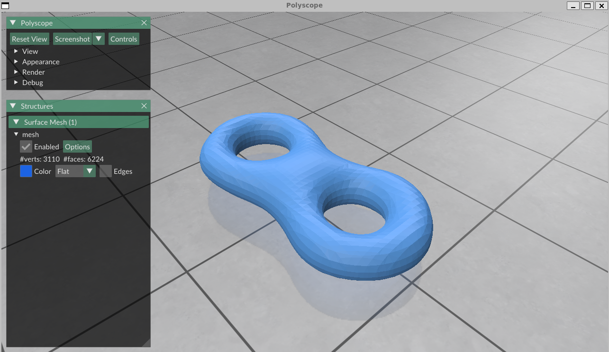

# 3D-reconstruction
Some algorithms of reconstructing mesh from point cloud

The following implementation adopts a more straightforward variant of the algorithm described in the reference paper, consequently exhibiting modest performance degradation relative to the results in papers.

tested on ubuntu 18.04.5

There are 4 dependencies needed: polyscope for visualization, Eigen and nlopt for matrix manipulation and solving linear equations, geometry-central for representation geometry, download Eigen and nlopt in folder 'deps', then colne polyscpoe and geometry-central via https://github.com/ezhangle/polyscope and https://github.com/nmwsharp/geometry-central 

mkdir build and cd build. Then run 

```bash
cmake ..
```
```bash
make
```

And there will be a CMakeProject1, use the following command to run the experiment:
```bash
./CMakeProject1
```

To run on diffenrent datas, modify the main.cpp in ./src:
```bash
std::string filepath = "../../input/double-torus.obj"; 
```
replace the filepath, eg:
```bash
std::string filepath = "../../input/bunny.obj"; 
```
for more obj files, see ./input.

Some results:


