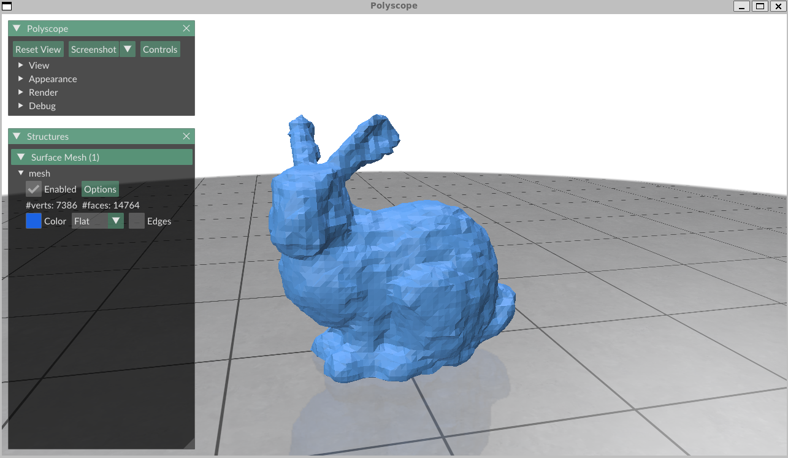
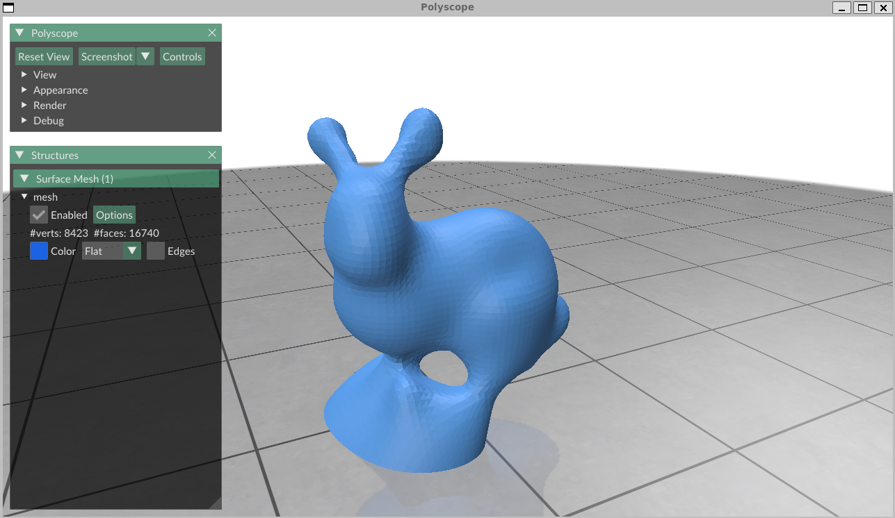

# 3D-reconstruction
Some algorithms of reconstructing mesh from point cloud

## References
- [Poisson surface reconstruction](https://dl.acm.org/doi/10.5555/1281957.1281965)
- [Variational Implicit Point Set Surfaces](https://dl.acm.org/doi/10.1145/3306346.3322994)
- [Surface Reconstruction from Point Clouds without Normalsby Parametrizing the Gauss Formula](https://dl.acm.org/doi/10.1145/3554730)

The following implementation adopts a more straightforward variant of the algorithm described in the reference paper, consequently exhibiting modest performance degradation relative to the results in papers.

tested on ubuntu 18.04.5
## Dependencies 
1. polyscope for visualization https://github.com/ezhangle/polyscope
2. Eigen and nlopt for matrix manipulation and solving linear equations,
3. geometry-central https://github.com/nmwsharp/geometry-central

Download or clone these dependencies to ./deps.

## run experiments
mkdir build and cd build. Then run 

```bash
cmake ..
```
```bash
make
```

And there will be a CMakeProject1, use the following command to run the experiment:
```bash
./CMakeProject1
```

To run on diffenrent datas, modify the main.cpp in ./src:
```bash
std::string filepath = "../../input/double-torus.obj"; 
```
replace the filepath, eg:
```bash
std::string filepath = "../../input/bunny.obj";
```
Then make and run ./CMakeProject1 to see the modified result.
for more obj files, see ./input.


## Some results





## Acknowledgements

This project uses obj files from the following MIT-licensed repositories:

- [ddg-exercises](https://github.com/GeometryCollective/ddg-exercises) - [Used the obj files in input file]


